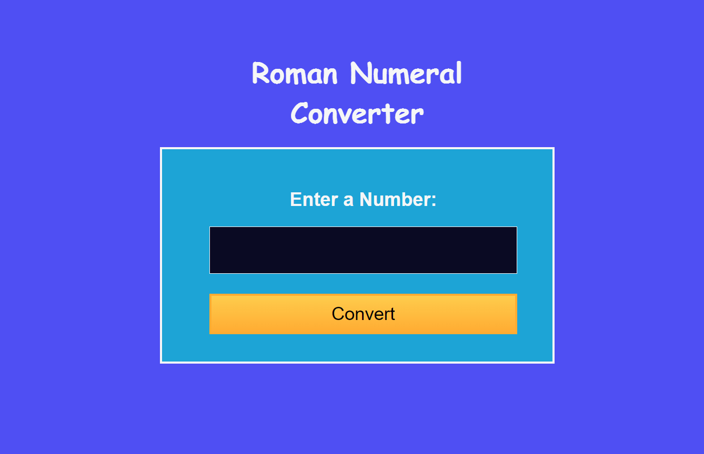

# Roman-converter-project
# Project Description 📝
Create Roman-converter-project  using HTML and CSS,script.js. Apply all the instruction of Roman-converter-project on freecodecamp.org .

## Demo 📸
life demo : 

here is a demo of Roman-converter-project .
```html
<!DOCTYPE html>
<html lang="en">
  <head>
    <meta charset="UTF-8" />
    <meta name="viewport" content="width=device-width, initial-scale=1.0" />
   
    <link rel="stylesheet" type="text/css" href="styles.css" />
   
    <title>Roman Numeral Converter</title>
  </head>
  <body>
    <main>
      
      <h1>Roman Numeral Converter</h1>
      <form id="form" class="form">
        <fieldset>
          <label for="number">Enter a Number:</label><br />
          <input type="number" id="number" required />
          <button type="button" id="convert-btn">Convert</button>
        </fieldset>
      </form>
      <div id="output" class="output hidden"></div>
    </main>
    <script src="script.js"></script>
  </body>
</html>


```
```css
* {
  padding: 0;
  margin: 0;
  box-sizing: border-box;
}

body {
  min-height: 100vh;
  padding: 50px 20px;
  font-family: 'Lato', Helvetica, Arial, sans-serif;
  font-size: 18px;
  background-color: #4f4ff3;
  color: #f5f6f7;
}

main {
  display: flex;
  flex-direction: column;
  align-items: center;
  justify-content: center;
}

h1 {
  text-align: center;
  margin: 20px auto;
  max-width: 350px;
  font-family: 'Castoro Titling', cursive;
}

form {
  color: #f5f6f7;
  margin: auto 25px;
  padding: 15px 0 0 15px;
  border: 3px solid #f5f6f7;
  text-align: center;
  width: 90%;
  max-width: 500px;
  background-color: #1da4d6;
}

fieldset {
  border: 0 none;
  height: 100%;
  padding: 25px;
  margin: 10px 20px;
}

label {
  display: inline-block;
  font-size: 1.5rem;
  margin-bottom: 10px;
  font-weight: bold;
}

input {
  display: block;
  font-size: 2.5rem;
  width: 100%;
  height: 60px;
  padding: 6px 12px;
  margin: 10px 0;
  line-height: 1.4;
  color: white;
  background-color: #0a0a23;
  border: 1px solid #f5f6f7;
}

button {
  cursor: pointer;
  margin-top: 15px;
  text-decoration: none;
  background-image: linear-gradient(#fecc4c, #ffac33);
  border: 3px solid #feac32;
  padding: 10px 16px;
  font-size: 23px;
  width: 100%;
}

input:focus-visible,
button:focus-visible {
  outline: 3px solid #198eee;
}

.output {
  color: white;
  background-color: #1da4d6;
  border: 3px solid #f5f6f7;
  font-size: 2.5rem;
  width: 90%;
  max-width: 500px;
  min-height: 55px;
  margin-top: 25px;
  padding: 15px;
  overflow-wrap: break-word;
  text-align: center;
}

.alert {
  font-size: 2rem;
  background-color: #ffadad;
  border: 3px solid #850000;
  color: #850000;
}

.hidden {
  display: none;
}

```
```js
const form = document.getElementById('form');
const convertButton = document.getElementById('convert-btn');
const output = document.getElementById('output');

const convertToRoman = (num) => {
  const ref = [
    ['M', 1000],
    ['CM', 900],
    ['D', 500],
    ['CD', 400],
    ['C', 100],
    ['XC', 90],
    ['L', 50],
    ['XL', 40],
    ['X', 10],
    ['IX', 9],
    ['V', 5],
    ['IV', 4],
    ['I', 1],
  ];
  const res = [];

  ref.forEach((arr) => {
    while (num >= arr[1]) {
      res.push(arr[0]);
      num -= arr[1];
    }
  });

  return res.join('');
};

const isValid = (str, int) => {
  let errText = '';

  if (!str || str.match(/[e.]/g)) {
    errText = 'Please enter a valid number.';
  } else if (int < 1) {
    errText = 'Please enter a number greater than or equal to 1.';
  } else if (int > 3999) {
    errText = 'Please enter a number less than or equal to 3999.';
  } else {
    // No errors detected
    return true;
  }

  // Handle error text and output styling
  output.innerText = errText;
  output.classList.add('alert');

  return false;
};

const clearOutput = () => {
  output.innerText = '';
  output.classList.remove('alert');
};

const updateUI = () => {
  const numStr = document.getElementById('number').value;
  const int = parseInt(numStr, 10);

  output.classList.remove('hidden');

  clearOutput();

  if (isValid(numStr, int)) {
    output.innerText = convertToRoman(int);
  }
};

form.addEventListener('submit', (e) => {
  e.preventDefault();
  updateUI();
});

convertButton.addEventListener('click', () => {
  updateUI();
});

```


## Technologies Used 🛠️
List the technologies or tools that i used to develop this project.
Javascript
HTML
CSS
## Installation 💻
for using this project you need to install 3 things:

chrombrowser
an IDE like vscode
git

## Usage 🎯
for using this project you need to know a few commond first clone the repositry in yor local machine then go to the github directory . open the project on your IDE like vscode and start working on it .

go to the cmd and clone the palindrom-checker-project using this commond:

git clone https://github.com/Sharifarezaie/Roman-converter-project/
go to the github directory:

cd>tribute-page
open the project on your IDE like vscode :

cd>Roman-converter-project> code .

## Features ⭐
Responsive webpage
-javascript
-github usage


## Author
# sharifaRezaie👩‍💻
LinkedIn: [(https://www.linkedin.com/in/sharifa-rezaie-646636309/)]
Email: [(sharifashaida82@gamil.com)]
## Contributing 🤝
For contribution you can create a pull request and mention me there.Thank you. #

## License